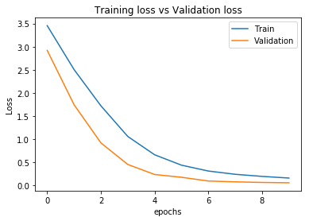

# **Traffic Sign Recognition** 

## Writeup


---

**Build a Traffic Sign Recognition Project**

The goals / steps of this project are the following:
* Load the data set (see below for links to the project data set)
* Explore, summarize and visualize the data set
* Design, train and test a model architecture
* Use the model to make predictions on new images
* Analyze the softmax probabilities of the new images
* Summarize the results with a written report


[//]: # (Image References)

[image1]: ./examples/visualization.png "Visualization"
[image2]: ./examples/grayscale.jpg "Grayscaling"
[image3]: ./examples/random_noise.jpg "Random Noise"
[image4]: ./test_image/60.png "Traffic Sign 1"
[image6]: ./test_image/tiltedSTOP.jpg "Traffic Sign 3"
[image7]: ./test_image/Children.png "Traffic Sign 4"
[image8]: ./test_image/Traffic.png "Traffic Sign 5"
[image9]: ./test_image/stop.png "Traffic Sign 6"
[image10]: ./test_image/Rw1.jpg "Traffic Sign 7"
[image11]: ./snipped/1.PNG "Prob 1"
[image12]: ./snipped/2.PNG "Prob 2"
[image13]: ./snipped/3.PNG "Prob 3"
[image14]: ./snipped/4.PNG "Prob 4"
[image15]: ./snipped/5.PNG "Prob 5"
[image16]: ./snipped/6.PNG "Prob 6"


## Rubric Points
### Here I will consider the [rubric points](https://review.udacity.com/#!/rubrics/481/view) individually and describe how I addressed each point in my implementation.  


### Data Set Summary & Exploration

#### 1. Provide a basic summary of the data set. In the code, the analysis should be done using python, numpy and/or pandas methods rather than hardcoding results manually.

I used the pandas library to calculate summary statistics of the traffic
signs data set:

* The size of training set is 34799
* The size of the validation set is 4410
* The size of test set is 12630
* The shape of a traffic sign image is (32,32,3)
* The number of unique classes/labels in the data set is 43

#### 2. Include an exploratory visualization of the dataset.

Here is an exploratory visualization of the data set. It is a bar chart showing how the data is divided as training and validation images. It shows the number of samples of each class on the traning set and the validation set.

![alt text][image1]

### Design and Test a Model Architecture

#### 1. Describe how you preprocessed the image data. What techniques were chosen and why did you choose these techniques? Consider including images showing the output of each preprocessing technique. Pre-processing refers to techniques such as converting to grayscale, normalization, etc. (OPTIONAL: As described in the "Stand Out Suggestions" part of the rubric, if you generated additional data for training, describe why you decided to generate additional data, how you generated the data, and provide example images of the additional data. Then describe the characteristics of the augmented training set like number of images in the set, number of images for each class, etc.)


I split the data using train_test_split() from sklearn.model_selection library. I have choosen 20% as test_size.  
 Then,I normalized the image data because I want the image data to be in the range from 0 to 1. 
 I have used ImageDataGenerator from Keras.preprocessing.image library to preprocess the data and augment it in real time. My ImageDataGenerator() argument values are given below
 
   | Argument                     |      Value               |
   |:----------------------------:|:------------------------:|
   |featurewise_center            |     False                |
   |featurewise_std_normalization |     False                |
   |shear_range                   |     0.1                  |
   |rotation_range                |     10.0                 |
   |width_shift_range             |     0.1                  |
   |height_shift_range            |     0.1                  |
   |zoom_range                    |     0.2                  |
         
 


#### 2. Describe what your final model architecture looks like including model type, layers, layer sizes, connectivity, etc.) Consider including a diagram and/or table describing the final model.
I have used Keras.Sequential to design my model architecture. Sequential is a keras container fot linear stack of layers. Layers will do automatic shape inference expect the first layer, In the first layer I have provided the input shape as (32,32,3).


I have designed a model with 6 convolutional layers and a fully connected layer. I have added one dropout layer to prevent overfitting. My output contains a softmax activation function to return the probabilties. 

My final model consisted of the following layers:

| Layer         		|     Description	        					        | 
|:---------------------:|:-----------------------------------------------------:| 
| Input         		| 32x32x3 RGB image   							        | 
| Convolution 1       	| 3x3 kernel, SAME padding, 32 Filters,relu activation 	|
| Convolution 2       	| 3x3 kernel, SAME padding, 32 Filters,relu activation 	|
| Max pooling 	      	| 2x2 stride, VALID padding                          	|
| Convolution 3       	| 3x3 kernel, SAME padding, 64 Filters,relu activation 	|
| Convolution 4       	| 3x3 kernel, SAME padding, 64 Filters,relu activation 	|
| Max pooling	      	| 2x2 stride, VALID padding                          	|
| Convolution 5       	| 3x3 kernel, SAME padding, 128 Filters,relu activation	|
| Convolution 6       	| 3x3 kernel, SAME padding, 128 Filters,relu activation	|
| Max pooling	      	| 2x2 stride, VALID padding                          	|
| Flatten				|                   									|
| Dense 1       		| Outputs 512, relu activation  						|
| dropout				| Keep_prob=0.5									        |
| Dense 2           	| Outputs 43, softmax activation						|


To train the model, I have used 'categorical_crossentropy' as my loss fucntion, 'stochastic gradient descent(SGD)' as optimizer and metric is 'accuracy' and compiled the model using keras model.compile().

While Training the model I have generated more data on the fly by keras preprocessing techniques. 
I have used LearningRateScheduler from keras.callbacks library to select decaying learning rate over the epochs. I have used below function to decay the learning over the epochs.
```
def learning_rate(epoch):
    return 0.001*(0.1**int(epoch/10))
```
I have trained the model using below function in keras

`model.fit_generator(datagen.flow(X_train,y_train,batch_size=batch_size),steps_per_epoch=1500,epochs=epochs,validation_data=(X_validation,y_validation) , callbacks=[LearningRateScheduler(lr_schedule), ModelCheckpoint('model.h5',save_best_only=True)])`

Hyper parameters used in the model are given below

  |HyperParameter       |      Value       |
  |:-------------------:|:----------------:|
  |  Epochs             |    10            |
  | Batch Size          |    32            |
  | Learning rate       |    0.001         |
  | Keep_Prob           |    0.5           |


First, my parameters are like- Constant learning rate=0.001, epochs=30,batch_size=32, steps_per_epoch=X_train.shape[0]//batch_size, and I had 3 dropout layers in my CNN. With this setup I have got a validation accuracy of 90.65%. 

Later, I used decaying learning rate, epochs=10, batch_size=64, and removed two dropout layers, My  validation accuarcy was 94.87%

When I set the `steps_per_epoch=X_train.shape[0]` and It took a lot of time to train the model. 

After trying different values for parameters, finally I have used decaying learning rate, epochs=10, Batch_size=32, steps_per_epoch=1500, I have got a validation accuracy of 98.38%


My final model results were: 
* training set accuracy of 95.00%
* validation set accuracy of 98.38% 

Below I have provided the Learning curves 

 

### Test a Model on New Images

#### 1. Choose five German traffic signs found on the web and provide them in the report. For each image, discuss what quality or qualities might be difficult to classify.

Here are six German traffic signs that I found on the web:

![alt text][image4]  ![alt text][image7] 
![alt text][image9] ![alt text][image8] ![alt text][image6]
![alt text][image10]

The first four images are colored opaque images so I converted them to 3 channel(RGB) images. 
The last two images might be difficult to classify because the STOP sign is tilted at angle when it is resized to (32,32) it has become more noisy, And the Road work sign in not clear and also tilted. 

Since I have added more image data by preprocessing the images while trianing my model is able to identify thes images correctly. Without data augmentation It may be difficult to identify the signs in these two images. 

#### 2. Discuss the model's predictions on these new traffic signs and compare the results to predicting on the test set. At a minimum, discuss what the predictions were, the accuracy on these new predictions, and compare the accuracy to the accuracy on the test set (OPTIONAL: Discuss the results in more detail as described in the "Stand Out Suggestions" part of the rubric).

Here are the results of the prediction:

| Image			        |     Prediction	        					| 
|:---------------------:|:---------------------------------------------:| 
| Speed limit (60km/h)  | Speed limit (60km/h)							| 
| Children crossing		| Children crossing				 				|
| Traffic signals		| Traffic signals      							|
| Stop  				| Stop  										|
| Road work				| Roadwork                  					|
| tilted STOP       	| STOP   										|


The model was able to correctly guess all the 7 traffic signs, which gives an accuracy of 100%. 

#### 3. Describe how certain the model is when predicting on each of the five new images by looking at the softmax probabilities for each prediction. Provide the top 5 softmax probabilities for each image along with the sign type of each probability. (OPTIONAL: as described in the "Stand Out Suggestions" part of the rubric, visualizations can also be provided such as bar charts)

The top five probalities for each test image is given below. 
Probabilties are 1 for all the test images except for 60 speed limit the accuracy was 99.445%.

 
![alt text][image11] ![alt text][image15] ![alt text][image13] 
![alt text][image12] ![alt text][image17] ![alt text][image16]
![alt text][image14]


